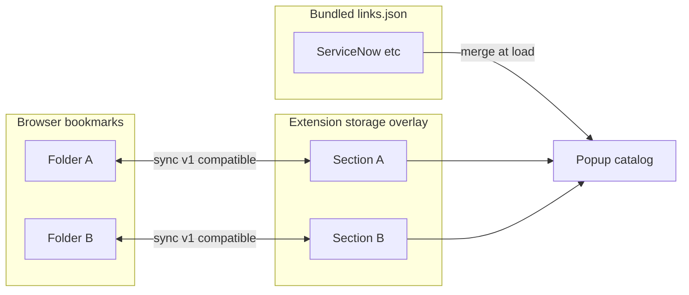

# Bookmark Sync — Polished Concept & Implementation Plan

## What you decided

| Dimension | Choice |
|---|---|
| **Modes** | Import-only, export-only, bidirectional, plus always-available **Import once** / **Export once** (independent of live sync) |
| **Live sync** | On bookmark create/update/move/remove events (when enabled) |
| **Scope** | User picks **multiple folders** *or* syncs the **entire tree** (top-level bookmark folders → section tabs) |
| **Storage** | Each synced folder = one overlay section ([`linksJsonOverlay`](lib/storage-keys.js)); bundled [`data/links.json`](data/links.json) unchanged |
| **Compatible types (v1)** | Canonical schema from [unified link behaviors](unified_link_behaviors_38055a6d.plan.md): plain `javascript:` ↔ `code` actions; **nav** (`code`+`open`) ↔ `__clNav__`; URL+extract ↔ `__clDerive__`; static/relative `url` ↔ bookmark URL. No legacy `type`/`path`/`nav`/`hostPattern` in convert output. |
| **Incompatible (v1)** | Skip + document: on-load-only semantics, `open: "download"` non-URL payloads, **`params.*.source: "contextElement"`**, `sandbox` / `sandbox: "readonly"`, custom `resolve` scripts, etc. |
| **Identity** | Store `bookmarkId` on nodes; first match falls back to normalized URL + title (+ folder path) |
| **Conflicts** | Detect dual-side edits → **notify, pause auto-sync** for affected items → user triggers manual sync → **newest wins** |
| **Context menu** | Scriptlets with a param `source: "contextElement"`; inject live DOM `Element`; also Copy CSS selector / Copy outerHTML |

## Current baseline

- One-way **offline** import already exists: [`scripts/parse-bookmarks.js`](scripts/parse-bookmarks.js) reads Netscape HTML export → writes `links.json`. Conversion logic (`hrefToLinkFields`, hostPattern inference) is the seed for runtime import.
- Runtime catalog = **bundled + overlay merge** via [`lib/link-catalog.js`](lib/link-catalog.js) `mergeLinksCatalog()`.
- Custom/overlay links already carry stable `id` (UUID) via `ensureLinkId()`.
- No `bookmarks` permission or `browser.bookmarks` usage yet.



## Architecture

### 1. Shared conversion module — `lib/bookmark-sync-convert.js`

Extract and unify logic from [`scripts/parse-bookmarks.js`](scripts/parse-bookmarks.js) (Node) and add reverse conversion:

**Depends on unified link schema** ([unified link behaviors](unified_link_behaviors_38055a6d.plan.md)): convert module reads/writes **canonical** nodes (`code` / `url` / `open` / `match` / `params` / `extract`), not legacy `type`/`path`/`nav`/`hostPattern`/`parameter`.

**Bookmark → link node (import)**
- Plain `javascript:` → `{ code }` (reuse [`normalizeScriptInput`](lib/link-model.js)); bare-identifier bodies
- **`__clNav__` bookmark** → `{ code, open }` — unwrap inner body + config
- **`__clDerive__` bookmark** → `{ open, match?, url?, extract?, params? }` — restore from embedded JSON config (not by reverse-parsing generated extract code)
- `http(s)://…` → `{ url, open: "tab" }` with optional section `match` inference
- `/relative/path` → `{ url, open: "same-tab" }`
- Attach sync metadata: `bookmarkId`, `bookmarkDateModified`, `syncSource: "bookmark"`

**Link node → bookmark (export)** — only if `isSyncCompatible(node)`:
- Plain `code` (no `open`) → `javascript:` URL using **param bindings** (`new Function(...names, code)(...values)` after prompts) — **not** `$name` substitution
- `code` + `open` → `__clNav__` wrapper (below)
- `url` only (no extract/templates needing page extract) → plain bookmark URL
- `url` + `extract` and/or templates → `__clDerive__` compiled bookmarklet (below)
- Skip incompatible nodes silently; count for UI summary

#### Nav scriptlet wrapper — `__clNav__`

Navigation scriptlets run page code that **returns a URL**, then the extension navigates per `nav` ([`activate-link.js`](popup/activate-link.js) + [`coerceScriptletNavigationUrl`](lib/navigation-shared.js)). Bookmarks cannot store a separate `nav` field, so export wraps the script in an **easily identifiable** IIFE:

```javascript
javascript:void(function __clNav__(cfgJson, code){
  var cfg = JSON.parse(cfgJson); /* { open, params? } */
  /* prompt params → new Function(...names, code)(...values); return URL; navigate per cfg.open */
}('{"open":"tab"}', '/* user code — bare bindings; must return a URL string */'))
```

**Import:** detect `__clNav__` by name → parse config JSON + inner `code`; restore `open` / `params`.

#### Derived-url wrapper — `__clDerive__`

`derived-url` links with `extract` and/or `url` templates ([`resolveDerivedUrl`](lib/navigation-shared.js)) cannot round-trip as a static bookmark URL. Export compiles them into a **self-contained bookmarklet** that mirrors extension behavior in the page:

1. **`match` guard** — if `match` is set on the node (or inherited section pattern passed into export), test `location.hostname` and `location.href`; **return early** (no navigation) if neither matches
2. **Extract values** — URL regex captures from `location.href`; DOM reads via `document.querySelector` + `textContent` / `innerHTML` / `id` / attribute (same sources as extension extract)
3. **Parameter prompts** — for any param still empty after extract, call `prompt()` per def; cancel/empty-required → exit
4. **Build target URL** — apply `{origin}`, `{param}`, `{encode:param}` via [`applyTemplate`](lib/link-model.js); resolve relative `url` against `location.origin`
5. **Navigate** — in-page per `open` (`location.assign`, `window.open`, etc.)

**Wrapper shape** — metadata in a JSON string literal arg (canonical fields); runtime body is **codegen** from that config:

```javascript
javascript:void(function __clDerive__(cfgJson){
  var node = JSON.parse(cfgJson);
  if (node.match) {
    var re = new RegExp(node.match, 'i');
    if (!re.test(location.hostname) && !re.test(location.href)) return;
  }
  /* generated: extract → values → targetUrl → navigate per node.open */
}('{"open":"same-tab","match":"\\\\.service-now\\\\.com$","extract":{"target":{"url":"..."}},"url":"{origin}/now/nav/..."}'))
```

**Import:** detect `__clDerive__` by name → `JSON.parse` → reconstruct canonical URL-action fields (`url` / `open` / `match` / `extract` / `params`).

**Export codegen** must stay aligned with extension extract + URL resolve semantics. Shared helpers in `lib/bookmark-sync-convert.js` with parity against catalog entries (e.g. “Show navigator”).

**Detection priority on import:** `__clDerive__` → `__clNav__` → plain scriptlet → http(s) URL → relative path.

#### Parameter prompting (all scriptlet exports)

Required params without defaults are supported in bookmarklets via **`prompt()`** at runtime. Export embeds `parameter` / `parameters` defs in wrapper metadata (JSON config for `__clDerive__`; extended `__clNav__` / plain scriptlet forms include param defs when present).

**Codegen preamble** (shared helper, runs before user code / extract):
- For each param from [`getParameterDefs`](lib/link-model.js): if value not already supplied by extract and no default (or default empty + not `optional`), call `prompt(label, defaultOrEmpty)`
- **Cancel** (`prompt` returns `null`) → exit bookmarklet early (no navigation / no script side effects)
- **Empty required** → exit early (same as extension validation)
- Run scriptlet bodies with **bindings** (same as extension): `new Function(...names, code)(...values)` — do **not** `$name`-substitute into `code`. Derive flows still fill a `values` map for URL templates.

Example plain scriptlet export:

```javascript
javascript:void(function __clRun__(paramsJson, code){
  var defs = JSON.parse(paramsJson);
  var names = [], values = [];
  for (var i = 0; i < defs.length; i++) {
    var d = defs[i];
    var v = prompt(d.label || d.name, d.default || '');
    if (v === null) return;
    if (!d.optional && v === '') return;
    names.push(d.name);
    values.push(v);
  }
  return new Function(...names, code).apply(null, values);
}( '[{"name":"limit","default":"100"}]', '/* body uses bare limit */' ))
```

For `__clNav__` / `__clDerive__`, param defs live in the same JSON config blob as `open` / `extract` / `url` / `match`; import round-trips `params`.

Refactor [`scripts/parse-bookmarks.js`](scripts/parse-bookmarks.js) to use the shared module so CLI and runtime stay aligned.

### 2. Sync engine — `lib/bookmark-sync-engine.js` (background)

**Config** (new storage keys in [`lib/storage-keys.js`](lib/storage-keys.js)):
- `bookmarkSyncEnabled`, `bookmarkSyncLive`, `bookmarkSyncMode` (`import` | `export` | `bidirectional`)
- `bookmarkSyncRoots`: `{ folderIds[], syncEntireTree: boolean }`
- `bookmarkSyncState`: per-item `{ bookmarkId, linkId, lastBookmarkModified, lastExtensionModified, lastSyncedAt }`
- `bookmarkSyncConflicts`: queue of pending conflicts
- `bookmarkSyncPaused`: global pause flag set when conflicts detected

**Operations**
- `importOnce()` / `exportOnce()` — full pass for configured roots; no event listener required
- `syncFromBookmarkEvent(event)` — incremental, debounced (~300ms), respects mode + pause flag
- `resolveConflictsManual()` — user-triggered; for each conflict pick side with newer timestamp; clear queue; resume live sync

**Folder → section mapping**
- Selected root folder title → overlay section name (1:1)
- Preserve nested bookmark folders as link-tree folder nodes (same shape as today’s catalog)
- Section-level `hostPattern` inferred from contained URLs (same as parse-bookmarks)

**Merge behavior with bundled catalog**
- Overlay sections with the same name as bundled sections (e.g. `ServiceNow`) **concatenate** per existing `mergeLinksCatalog` — synced bookmarks add to overlay children, bundled defaults remain. Document this; optional future override for “replace section” if needed.

### 3. Compatibility gate — `isSyncCompatible(node)`

**v1 compatible** (canonical schema)
- `code` only — plain or with `params` (prompt → bindings)
- `code` + `open` — `__clNav__` wrapper + bindings
- `url` only → plain URL bookmark
- `url` + `extract` and/or templates → `__clDerive__` (`match` guard + extract + template + prompts)

**v1 incompatible (skip + log)**
- `open: "download"` / non-URL payloads
- `sandbox: true` or `sandbox: "readonly"`
- Custom `resolve` scripts
- On-load-only semantics (not represented in bookmarks)
- Any `params.*.source: "contextElement"` — skip entire node on export

Document skipped types in [`CONTEXT.md`](CONTEXT.md) under a **Bookmark sync compatibility** section with a forward-looking table for future conversion work.

### 4. Conflict detection

Per mapped item, track last-seen modification times on both sides.

- **Bookmark change** while extension node `updatedAt` > `lastSyncedAt` → enqueue conflict, set `bookmarkSyncPaused = true`, surface notification/badge
- **Extension edit** (save to overlay) while bookmark `dateGroupModified` > `lastSyncedAt` → same
- Live event handler **no-ops** while paused (except conflict detection updates)
- **Manual sync** applies newest-wins, updates both sides for compatible fields only, clears conflict + pause

Use [`browser.notifications`](https://developer.mozilla.org/en-US/docs/Mozilla/Add-ons/WebExtensions/API/notifications) (add optional permission) or in-popup banner for conflict notice.

### 5. Permissions & optional enable

Add to [`manifest.json`](manifest.json):

```json
"permissions": [ /* existing… */, "menus" ],
"optional_permissions": ["bookmarks", "notifications"]
```

`menus` is required for the context-menu feature (§9). Request `bookmarks` when user first enables sync (pattern matches existing master toggles). Keeps sync truly optional.

Register background listeners only while `bookmarkSyncLive && bookmarkSyncEnabled && !bookmarkSyncPaused`.

### 6. Settings UI

Popup header is already dense ([`popup/popup.html`](popup/popup.html)). Add a dedicated **Bookmark Sync** page (mirror [`rules/rules.html`](rules/rules.html) pattern):

- Enable sync (requests permission)
- Mode: Import / Export / Bidirectional
- Live sync toggle
- Root selection: multi-folder picker (tree) *or* “Sync all top-level folders”
- Actions: **Import once**, **Export once**, **Resolve conflicts** (disabled when queue empty)
- Status line: last sync time, compatible/skipped counts, conflict count

Link from popup via small “Bookmarks…” button near existing Advanced/builder entry points.

### 7. Extension → bookmark write path

On export/bidirectional outbound:
- Ensure target bookmark folder exists (create under user-configured parent if missing)
- `browser.bookmarks.update(id, { title, url })` for mapped items
- `browser.bookmarks.create({ parentId, title, url })` for new extension-only compatible links in synced sections
- Never delete bookmarks automatically in v1 unless user explicitly runs export with a documented “replace folder contents” option (recommend **deferring deletes** to avoid data loss)

### 8. Overlay write path

On import/bidirectional inbound:
- Write into [`LINKS_OVERLAY_KEY`](lib/storage-keys.js) sections keyed by folder name
- Preserve non-synced overlay sections untouched
- Synced nodes get `bookmarkId`; user-edited compatible nodes update `updatedAt` for conflict tracking

Wire overlay saves in [`popup/link-storage.js`](popup/link-storage.js) / builder to bump `lastExtensionModified` for synced nodes.

### 9. Context menu (Firefox) — element via parameter `source`

Moved here from the Requestly-inspired plan so link-catalog UX (params, menus, activation) lives with bookmark/link tooling.

**Manifest:** add `"menus"` — use `browser.menus`.

**Schema:** element input is on the **parameter object**, not a top-level scriptlet flag.

```json
"params": {
  "element": { "source": "contextElement" }
}
```

Each `params` entry may include `"source": "contextElement"`.

**Behavior driven by that field:**

| Surface | Behavior |
|---|---|
| Popup link list | Exclude params with `source: "contextElement"` from editable inputs ([`popup/link-ui.js`](popup/link-ui.js)) |
| Context menu | List scriptlets that have ≥1 such param under **Complex Linker → Run with element** |
| Execution | Inject the live **DOM `Element` object** as that parameter’s value — not HTML, not a selector string |
| Bookmark sync | Incompatible for export (see §3); other string params on the same node still do not make the node exportable if any contextElement param exists |

**Helpers** in [`lib/link-model.js`](lib/link-model.js):

- `isContextElementParam(def)` — `def?.source === "contextElement"`
- `getContextElementParamNames(node)` / `scriptletAcceptsContextElement(node)`
- `getEditableParameterDefs(node)` — defs minus context-element sources (popup uses this)
- `isSyncCompatible` treats any contextElement param as incompatible

**Template / activation:**

- Do **not** stringify the element into the source.
- Run MAIN-world as `new Function(...paramNames, code)(...values)` where the context-element param’s value is the resolved `Element` (same binding model as unified link behaviors).
- Stamp+query bridge (Firefox `menus.getTargetElement`): isolated world stamps `data-sn-links-ctx`, MAIN world `querySelector` recovers the same DOM node, strip attr, pass that object as the named argument.

**Menu rebuild** (background): on startup + catalog/overlay changes:

- Parent: `Complex Linker`
- Submenu **Run with element** — one item per scriptlet with a `contextElement` param (`id: linkStorageKey`)
- **Copy CSS selector**
- **Copy outerHTML** (truncate ~2KB)

Filter by `hostPattern` vs `info.pageUrl` when practical.

**Bundled example:** update **Trace button click** so it uses (or gains) a `source: "contextElement"` param (e.g. `element`); adjust `code` to use the live element when invoked from the menu. Popup without an injected element leaves that param unset — keep optional pick behavior only when no element was injected.

Copy actions use `clipboardWrite` from the content-script helper.

**Param prompt codegen (§1):** when exporting other scriptlets, skip `source: "contextElement"` defs in `prompt()` preambles (those nodes are skipped entirely by `isSyncCompatible` in v1).

## Phased delivery

**Phase A — Foundation (usable one-shot sync)**
- Shared convert module + refactor CLI script
- `bookmarks` permission + settings page
- Import once / Export once for selected folders
- `bookmarkId` mapping + compatibility gate (including contextElement skip)

**Phase B — Live sync + conflicts**
- Bookmark event listeners (debounced)
- Conflict queue, pause, notification, manual resolve (newest wins)

**Phase C — Context menu + polish**
- `menus` permission, `parameter.source`, popup exclusion, Element injection, Copy selector/outerHTML
- Sync status UI, skipped-item report, CONTEXT.md compatibility + contextElement docs
- Edge cases: moved bookmarks, renamed folders, duplicate URLs

## Key risks / caveats

- **Nav / derive bookmarklet URL length**: wrapped `javascript:` URLs (especially `__clDerive__` with large `extract` configs) can hit bookmark length limits; surface skip warnings in sync status.
- **Codegen parity**: page-side `__clDerive__` extract/template logic must match extension [`resolveDerivedUrl`](lib/navigation-shared.js) for catalog entries; add at least one round-trip test per extract kind (url regex, dom selector).
- **Bookmark URL fidelity**: browsers store full URLs; instance-relative SN paths may round-trip as absolute unless section `hostPattern` + relative path are preserved intentionally on import (same approach as parse-bookmarks).
- **Section name collisions**: syncing a folder named `ServiceNow` merges with bundled defaults — may be desired or surprising; call out in UI.
- **Deletes**: v1 should not auto-delete on either side; orphaned mappings can be cleaned on next full import-once.
- **Firefox-first**: `browser.bookmarks` / `browser.menus` are WebExtensions-standard; test on Firefox (primary target per [`manifest.json`](manifest.json)).
- **Context element bridge**: MAIN-world recovery via stamped attribute must clear the stamp even if scriptlet throws.

## Files to touch (expected)

| File | Change |
|---|---|
| [`lib/bookmark-sync-convert.js`](lib/bookmark-sync-convert.js) | New — conversion, `__clNav__` / `__clDerive__` wrap-unwrap, derive codegen |
| [`lib/bookmark-sync-engine.js`](lib/bookmark-sync-engine.js) | New — sync orchestration, conflict state |
| [`lib/storage-keys.js`](lib/storage-keys.js) | New sync-related keys |
| [`lib/link-catalog.js`](lib/link-catalog.js) | Optional: helper to mark/update sync metadata on nodes |
| [`lib/link-model.js`](lib/link-model.js) | `source: "contextElement"` helpers; editable-param filter; sync gate |
| [`scripts/parse-bookmarks.js`](scripts/parse-bookmarks.js) | Refactor to use shared convert |
| [`manifest.json`](manifest.json) | `optional_permissions`, `menus`, sync page entry |
| [`sync/sync.html`](sync/sync.html) + [`sync/sync.js`](sync/sync.js) | New settings UI |
| [`background.js`](background.js) / [`lib/message-router.js`](lib/message-router.js) | Register sync engine + menus + messages |
| [`popup/popup.html`](popup/popup.html) | Link to sync settings |
| [`popup/link-ui.js`](popup/link-ui.js) / [`popup/activate-link.js`](popup/activate-link.js) | Hide contextElement params; Element injection path |
| [`data/links.json`](data/links.json) | Trace button click → `source: "contextElement"` |
| [`CONTEXT.md`](CONTEXT.md) | Compatibility matrix + contextElement behavior |
