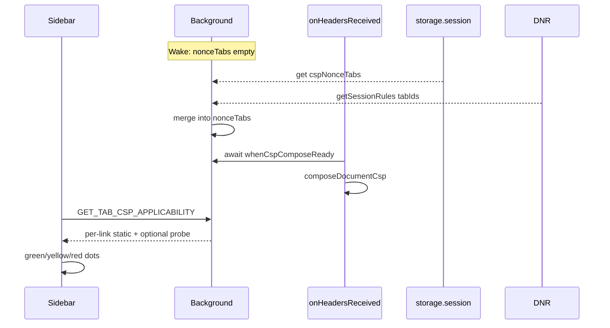

# CSP race fixes, cache recovery, and applicability UX

## Answers to your questions

### Step 6: synchronous storage or early wake?

**No synchronous storage read exists.** All `browser.storage.*` APIs (`session`, `local`, `sync`) are async. There is no way for `onHeadersReceived` to read `cspNonceTabs` synchronously at step 6.

**Early wake options (MV3, within Firefox):**

| Approach | Effect |
|---|---|
| **Promise-returning `onHeadersReceived`** | Awaits hydration before `isCspNonceTab` — fixes the race without new storage |
| **Dual hydrate from DNR** | `getSessionRules()` on wake repopulates `nonceTabs` from installed strip rules (browser already knows tabIds) |
| **Long-lived `runtime.connect` port** | Sidebar open keeps background alive — reduces wake frequency, not a correctness fix |
| **`alarms` keepalive** | Discouraged; does not guarantee wake before every navigation |

There is no API to pre-wake the background *before* DNR runs on a navigation. DNR executes in the browser process regardless; only the **re-add** step needs the background heap hydrated.

### How aggressively does Firefox sleep the background?

Firefox MV3 uses an **event page** (not a Chrome-style service worker). It suspends after a period of **inactivity** — commonly on the order of **~30 seconds to a few minutes**, not instant and not permanent. It wakes on: blocking `webRequest`, `runtime` messages, `alarms`, `tabs`/`webNavigation` events, etc.

While suspended: DNR session rules **stay installed**; in-memory maps (`nonceTabs`, `policyByUrl`, `framePolicyByFrame`, probe reasons) are **lost**.

`storage.session` survives suspend but is **cleared when the browser closes** (including a normal quit), even if tabs are restored on next launch.

### Probe results in session storage?

**Not today.** Classifications live in background **memory only**:

- [`lib/csp-nonce.js`](lib/csp-nonce.js): `punchReasonByFrame`, `framePolicyByFrame`, `nonceByFrame`
- [`lib/csp-compose.js`](lib/csp-compose.js): `policyByUrl`, `policyByOrigin`

`storage.session` currently holds only **`cspNonceTabs`** (toggle tab ids). [`GET_FRAME_CSP`](lib/background-messages.js) reads the in-memory maps. Dev-only probing lives in [`scripts/bidi-inspect.js`](scripts/bidi-inspect.js), not in the extension.

Optional later: cache **sidebar hint** results in `storage.session` keyed by `tabId:frameId:policyHash` so reopening the sidebar does not re-probe. Not required for v1.

---

## Your numbered suggestions

### 1. Don't strip until we have something to replace?

**Partially already true; cache-miss is the gap.**

[`syncCspDnrRules`](lib/csp-compose.js) installs **no** nonce-tab strip rules until `domainsNeedingStrip()` is non-empty — i.e. at least one host was passively observed with a policy that `policyNeedsDnrStrip()` (see lines 305–312). That avoids stripping Office/Slack-style live-nonce pages before any observation.

What remains: once strip is active for a host, a **new frame URL** on that host with **no cached seed** still gets stripped and fail-opens (`cache-miss` in [`composeDocumentCsp`](network/engine/network-webrequest.js)).

**Tighter option (recommended in this plan):** on cache-miss, **do not leave the document stripped with no policy** when nonce toggle is on — either await a one-shot background seed fetch (below) or skip strip for that response if no seed exists (requires listener-side logic; DNR may already have removed the header, so re-add path must handle empty seed).

### 2. Prune dead tab IDs before write-back

[`tabs.onRemoved`](lib/csp-compose.js) already removes closed tabs. Stale ids can still linger if `onRemoved` is missed or after odd restore edge cases.

**Low priority** given `storage.session` dies on browser quit. If implemented: before `persistNonceTabs()`, `tabs.query({})` and filter `nonceTabs` to existing ids. Same on hydration read. Cheap safety net.

### 3. Defer listener registration — more reloads?

**No extra user reloads.** Hard-reload after toggling nonce remains required (documents parsed before listeners). Deferring registration only narrows the post-wake race window; normal CSP bypass flow unchanged.

### 4. Cache miss → background fetch; observed always wins

Aligns with removed `prefetchCspPolicy` but with stricter cache rules:

- **On `cache-miss`:** issue extension `fetch(url)` (tabId -1, DNR `excludedTabIds: [-1]`) to read unstripped CSP **only when** no non-empty cache entry exists for that URL/origin.
- **`cacheCspPolicy` rule (explicit):** non-empty observed policy **always** `set`s; **never** overwrite a non-empty entry with empty; ignore empty fetch results.
- **Cookie-gated caveat:** fetch may still return a different policy than navigation (documented in CONTEXT). Treat fetch seed as best-effort; passive `onHeadersReceived` observation remains authoritative when it arrives.

Recovery is **for the next navigation** unless `onHeadersReceived` returns a Promise and awaits fetch on the miss path (adds latency once per URL).

---

## Architecture



---

## Implementation plan

### Phase 1 — Correctness (hydration + cache)

**1.1 Promise-wrap blocking listener**

In [`network/engine/network-webrequest.js`](network/engine/network-webrequest.js), change `onHeadersReceived` to:

```javascript
function onHeadersReceived(details) {
  return Promise.resolve(whenCspComposeReady()).then(() =>
    onHeadersReceivedSync(details)
  );
}
```

Re-test meta-CSP `filterResponseData` attachment (CONTEXT notes this may shift timing).

**1.2 Dual hydration**

Extend [`whenCspComposeReady`](lib/csp-compose.js) to also `getSessionRules()`, extract `tabIds` from rules with `id >= DNR_NONCE_ID_BASE`, merge into `nonceTabs` before `composeHydrated = true`.

**1.3 Cache-miss background seed**

- Add `seedCspPolicyFromFetch(url)` in [`lib/csp-compose.js`](lib/csp-compose.js) (or small helper module): fetch document URL, parse `Content-Security-Policy` header, call `cacheCspPolicy` only if result non-empty and no existing non-empty cache.
- On `cache-miss` in `composeDocumentCsp`: fire-and-forget `seedCspPolicyFromFetch(details.url)`; log once. Optionally trigger `syncCspDnrRules()` after seed so host enters `domainsNeedingStrip`.
- Strengthen `cacheCspPolicy` comment/tests: empty never overwrites; non-empty always replaces stale.

**1.4 Optional tab-id prune**

In `persistNonceTabs()` and hydration: filter tab ids against `browser.tabs.query({})`. Skip if you deem session-on-quit sufficient.

**1.5 Tests**

Extend [`scripts/test-csp-compose.js`](scripts/test-csp-compose.js) for new pure classifier (phase 2). Add node test for cache overwrite rules.

---

### Phase 2 — Static CSP classification (no external CSP libs)

Add pure function in [`lib/csp-compose-core.js`](lib/csp-compose-core.js) (unit-testable from Node):

```javascript
// classifyFrameInjectCsp({ sitePolicy, composedPolicy, punchReason, sandbox,
//   nonceToggle, networkDisableCsp, borrowableNonce }) 
// → { status: 'ok' | 'needs_bypass' | 'blocked' | 'uncertain', reason }
```

Reuse existing helpers: `policyNeedsDnrStrip`, `policyHasNonceOrHash`, `scriptDirectiveSources`, punch reasons from [`lib/csp-nonce.js`](lib/csp-nonce.js).

| Input | Typical status |
|---|---|
| `sandbox` `isolated`, `unsafe-window`, or `readonly-dom` (resolved) | `ok` — page CSP does not apply; never `needs_bypass` / `blocked` |
| No enforcing CSP / unsafe-inline | `ok` |
| Borrowable page nonce, toggle off | `ok` |
| Toggle on + successful punch / extension nonce | `ok` |
| Armed disable-CSP rule | `ok` |
| Strict `script-src` without bypass path | `needs_bypass` |
| `unsafe-inline-without-nonce` punch refusal | `blocked` |
| `not-seen`, `cache-miss`, `pending-navigation` | `uncertain` |

**No third-party CSP parser** — your [`csp-compose-core.js`](lib/csp-compose-core.js) already owns the semantics injection cares about; a library would not replace DNR/MV3 compose logic.

**1.6 Background message**

New type in [`lib/message-types.js`](lib/message-types.js): `GET_TAB_CSP_APPLICABILITY` with `{ tabId, links: [{ linkKey, sandbox, frames }] }`.

Handler in [`lib/background-messages.js`](lib/background-messages.js): for each link, resolve target frames via shared [`resolveFrameTargets`](lib/scriptlet-inject.js), read `getCspFramePolicy` / `getCspPunchReason` / `getCspNonce`, run classifier per frame, aggregate:

- `pageNeedsBypass`: top frame (frame 0) status
- `subframeBypassCount`: targeted descendants with `needs_bypass` or `blocked`
- `worstStatus`: for dot color

---

### Phase 3 — Sidebar dot UX (your preference)

**Behavior** ([`sidebar/link-ui.js`](sidebar/link-ui.js), [`sidebar/sidebar.css`](sidebar/sidebar.css), [`sidebar/sidebar.js`](sidebar/sidebar.js)):

| Dot | When |
|---|---|
| Hidden | Link does not apply to tab (unchanged) |
| Green | Applies + inject likely OK |
| Yellow | Applies + at least one targeted frame `needs_bypass` (not all blocked) |
| Red | Applies + all targeted MAIN frames `blocked` (or top-only link and top blocked) |

**Tooltip:** `Needs CSP bypass: {yes|no}, {N} sub-frame(s)` plus short reason when yellow/red (e.g. `script-src 'self'`).

Replace [`syncAppliesToTabDots`](sidebar/link-ui.js) with `syncTabApplicabilityDots(container, tabId, tabUrl, applicabilityMap)`:

- Pass `data-link-key`, `data-sandbox`, `data-has-code` on rows at render time for lookup.
- On tab switch / `CSP_NONCE_CHANGED` / visibility: message background for applicability (debounced ~200ms).
- Update dots asynchronously; default green when applies until response arrives, then refine to yellow/red.

CSS: `.link-applies-dot.is-csp-warn` (yellow), `.link-applies-dot.is-csp-blocked` (red); keep green default.

Only classify rows with `code` (Run / open-from-script). URL-only links skip CSP dot logic.

**Sandbox is the static “needs a punch” bit.** Resolve `sandbox` with `resolveSandbox` from the sandbox plan ([sandbox_unsafe-window](../../../.cursor/plans/sandbox_unsafe-window_79a57864.plan.md) — `lib/sandbox.js`). `"isolated"`, `"unsafe-window"`, and `"readonly-dom"` skip the punch: dot stays the normal applies-to-tab green, tooltip does not say a bypass is required. Only `"main"` runs the policy table above and can turn yellow or red. Pass the resolved sandbox on the row (`data-sandbox`) and in `GET_TAB_CSP_APPLICABILITY`.

---

### Phase 3b — Omnibox (unibar) hide known-blocked links

Firefox address-bar / omnibox suggestions in [`background.js`](background.js) should drop a `code` link when it matches the current tab but the classifier says it **cannot** run there.

- Exclude `worstStatus === "blocked"` for resolved `"main"` only.
- Keep `needs_bypass` (yellow: punch would allow it) and `uncertain` (not known-blocked).
- Never exclude `"isolated"` / `"unsafe-window"` / `"readonly-dom"` for CSP.
- URL-only leaves are unchanged.

Reuse `GET_TAB_CSP_APPLICABILITY` (or the same classifier) against the active tab at suggestion time. Do not invent a second CSP policy.

---

### Phase 4 — Optional async probe (uncertain only)

Extract minimal noop probe from [`evaluateCompiledInPage`](lib/scriptlet-inject.js) (or share `scripts/bidi-inspect.js` logic) into `probeFrameInjectMethods(tabId, frameId)` in background.

- Run only when static classifier returns `uncertain` for a frame.
- Cache in background `Map` keyed by `tabId:frameId:hash(sitePolicy+toggle)`.
- Invalidate on navigation / nonce toggle / network arm.

Skip probe for v1 if time-constrained; static + Inspect still valuable.

---

### Phase 5 — Inspect consolidation

Extend [`buildLinkInspectSnapshot`](lib/link-inspect.js) for `code` links:

- For each entry in `frames[]`, add columns: `sitePolicy` (truncated), `punchReason`, `injectStatus`, `needsBypass`.
- Source: same `GET_FRAME_CSP` / classifier as sidebar.
- [`dumpInspectSnapshotToTab`](lib/link-inspect.js): existing `console.table(frames)` automatically shows new columns.

Optional summary line: `pageNeedsBypass`, `subframeBypassCount`.

---

## Files touched (summary)

| File | Change |
|---|---|
| [`network/engine/network-webrequest.js`](network/engine/network-webrequest.js) | Async `onHeadersReceived`, cache-miss fetch trigger |
| [`lib/csp-compose.js`](lib/csp-compose.js) | Dual hydration, fetch seed, cache rules, tab prune |
| [`lib/csp-compose-core.js`](lib/csp-compose-core.js) | `classifyFrameInjectCsp` |
| [`lib/message-types.js`](lib/message-types.js) | `GET_TAB_CSP_APPLICABILITY` |
| [`lib/background-messages.js`](lib/background-messages.js) | Handler |
| [`sidebar/link-ui.js`](sidebar/link-ui.js) | Dot states + data attrs |
| [`sidebar/sidebar.css`](sidebar/sidebar.css) | Yellow/red dot styles |
| [`sidebar/sidebar.js`](sidebar/sidebar.js) | Debounced applicability sync |
| [`background.js`](background.js) | Omnibox: omit suggestions known CSP-blocked on the active tab |
| [`lib/link-inspect.js`](lib/link-inspect.js) | CSP columns on frames table |
| [`scripts/test-csp-compose.js`](scripts/test-csp-compose.js) | Classifier + cache tests |

---

## Manual test plan

1. Enable nonce on tab, suspend background (`about:debugging` → inspect background → close devtools, wait ~60s), hard-navigate subframe — verify composed policy re-added (no fail-open).
2. Toggle nonce on site with `script-src 'self'`, hard reload — green dots on Run links; yellow after classifier sees strict policy with toggle off.
3. Enable nonce — dots return green; injection works without eval.
4. Inspect on a multi-frame link — frame table shows CSP columns aligned with dot color.
5. Cache-miss scenario (third-party frame first load after toggle) — background fetch logs; second navigation seeds policy (or miss logged once).
6. A `main` link that is CSP-blocked on the tab is absent from omnibox suggestions; an `isolated` or `unsafe-window` link on that same page still appears. A `main` link that only *needs* the punch (toggle off, policy punchable) still appears.

---

## Out of scope

- Manifest V2 conversion
- Third-party CSP evaluation libraries
- Persisting probe maps to `storage.session` (optional follow-up)
- Per-row probe on context menu only (tab-switch batch is sufficient per your async OK)
