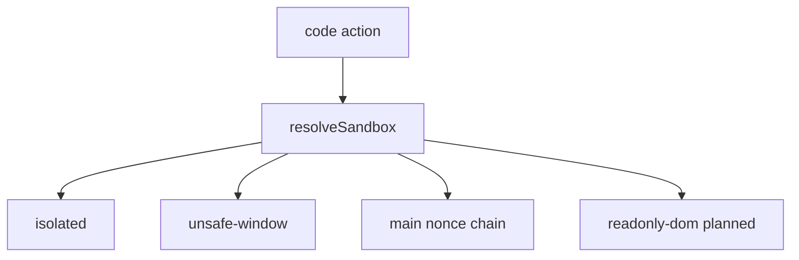

# Sandbox ladder: DOM, page objects, MAIN

DOM-only `"isolated"` and planned `"readonly-dom"` stay separate. The earlier three-level sketch was not a closed list.

## Page runtime cannot become the script global

`wrappedJSObject` waives Xrays on an object. It does not change the realm the scriptlet runs in. A function created in ISOLATED still has the content-script global: bare `GlideForm`, `globalThis`, and `instanceof` stay in that realm.

These approximations are inconsistent with this catalog (mixed `globalThis.g_form` and bare `GlideForm` / `gsft_main`):

- `with (window.wrappedJSObject)` — bare names can resolve on the page; `globalThis` still means the isolated realm.
- Shadowing `globalThis` — `globalThis.g_form` works; bare constructors do not.

Do not do either. Scripts that opt into page objects get one documented binding:

```js
unsafeWindow = window.wrappedJSObject
```

That is the page `window`. Read and call through it (`unsafeWindow.g_form`, `unsafeWindow.GlideForm`). It is not a second `globalThis`, and it is not same-realm identity. Nested frame windows (for example `gsft_main`) often need their own `.wrappedJSObject`; do not auto-proxy the graph.

Copy-as-script stays the plain IIFE. Do not embed `wrappedJSObject` in pasted source (a page console has no Xray waiver). Reserve the name `unsafeWindow` so it cannot be a `params` key.

## Levels (one `sandbox` field)

Weakest implemented level that still works. `"readonly-dom"` is documented as planned and is not assigned during conversion (today it behaves like `"isolated"` and can still write the live DOM).

- **`"isolated"`** — ISOLATED, live DOM, no page JS. Page CSP does not apply. Enough for selectors, `location`, URL strings, `console`.
- **`"unsafe-window"`** — same world, plus `unsafeWindow`. Call and read page APIs. Not for `fetch` / prototype / callback installs the page must treat as its own.
- **`"main"`** — page realm via the existing nonce chain in [lib/scriptlet-inject.js](lib/scriptlet-inject.js). This is the only value that needs the CSP punch.
- **`"readonly-dom"`** — planned clone iframe (opaque origin, snapshot only). Not implemented. README keeps it as planned, with the current caveat that the value still uses the live DOM.

Defaults for a missing field (custom links and new builder rows), applied only in `resolveSandbox`:

- `open-from-script` (`code` + `open`): `"isolated"`.
- Other `code` actions: `"main"`.

`navParams` / URL templates are not scriptlets.

[lib/link-model.js](lib/link-model.js) currently turns `normalizeSandbox("main")` into “omit”. That must stop. Persist the explicit value, including `"main"`, whenever the leaf declares one. Omission remains only the behavior default above.



## Centralize

New [lib/sandbox.js](lib/sandbox.js) owns the enum, `normalizeSandbox`, `defaultSandbox(node)`, `resolveSandbox(node)`, `scriptletWorld`, and `grantsPageWindow`. [lib/link-model.js](lib/link-model.js) and [lib/scriptlet-inject.js](lib/scriptlet-inject.js) import it and drop their duplicated `SANDBOX_*` constants.

ISOLATED runner, only when `grantsPageWindow`:

```js
new Function("unsafeWindow", `return ${compiled}`)(window.wrappedJSObject)
```

[lib/navigation-shared.js](lib/navigation-shared.js) `extractValuesFromDom` moves from `world: "MAIN"` to `"ISOLATED"` (selectors only).

## Catalog

Every `code` leaf in [data/links.json](data/links.json) gets an explicit `sandbox` at the minimum implemented level:

- DOM / `location` / URL / `console` only → `"isolated"`. No source change beyond dropping unused page lookups.
- Read or call page APIs, return data, no same-realm hooks → `"unsafe-window"`, and rewrite page lookups to `unsafeWindow` (including bare `GlideForm` / `GlideList2` and frame windows).
- Same-realm patches (`fetch`, XHR, prototypes, `location` setters, assigned callbacks, `<script src>` loaders) → `"main"`. Leave source in page-global style.

Do not tag leaves `"readonly-dom"`.

## Docs and UI

Document all four values in the README sandbox section, the CONTEXT sandbox table, and the builder select + hint in [builder/builder.html](builder/builder.html). Each value states: world, whether page JS is visible, the binding name if any, whether page CSP applies, and implemented vs planned.

Tests: `resolveSandbox` defaults, explicit `"main"` round-trips, `scriptletWorld("unsafe-window") === "ISOLATED"`, `grantsPageWindow` only for that value.

## Not in this plan

Sidebar CSP dots and omnibox (unibar) hiding of links that cannot run are specified in [csp_race_and_ux_4f300e02.plan.md](.cursor/plans/csp_race_and_ux_4f300e02.plan.md). That classifier treats `"isolated"`, `"unsafe-window"`, and `"readonly-dom"` as not needing a punch; only `"main"` can be yellow or red.
