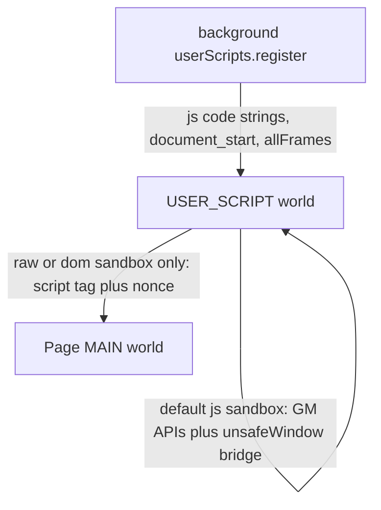

# Tampermonkey MV3 vs Hackery Lab injection

Source checked: [c:\Users\jsmith\extracted_extension](c:\Users\jsmith\extracted_extension) — Tampermonkey **5.5.0 Chrome** (`minimum_chrome_version: 120`, `background.service_worker`). This is not the Firefox build. Hackery Lab is Firefox-only ([manifest.json](manifest.json), `strict_min_version: 128`).

## How Tampermonkey actually runs scripts

Default setting `runtime_content_mode: "userscripts"` (also `"userscripts-dynamic"`). Both go through `chrome.userScripts`, not `scripting.executeScript` into the page.

What the minified background does (`background.js` around the `IA` registrar):

- `userScripts.configureWorld({ csp: "script-src 'self' 'unsafe-inline' …", messaging: true })`. DOM sandbox mode adds `'unsafe-eval' *`. That CSP belongs to the **USER_SCRIPT world**, not the page.
- Each enabled script is registered as `world: "USER_SCRIPT"`, `runAt: "document_start"`, `js: [{ code: "…" }]`. The code only stashes metadata on `window.tm_scripts`.
- `page.js` and `content.js` are also registered in `USER_SCRIPT`. `content.js` then `eval`s the userscript inside that world (`o.global.eval` from `userScripts.onBeforeScript`).
- `scripting.executeScript({ world: "MAIN" })` is only a small stub (`window.external.Tampermonkey`) and a history-back helper. It is not the script runner.
- Chrome requires the user to turn on “Allow user scripts” or registration fails (they poll and show a developer-mode notice).

Page JS access is a second, optional path:

- Sandbox `raw` / `dom` injects a real `<script>` into the document (`Ss` in `content.js`: set `nonce`, set `textContent`, append). Same idea as [lib/scriptlet-inject.js](lib/scriptlet-inject.js) nonce-inline.
- `webrequest_fixCSP: "remove"` installs one DNR session rule that **deletes** `Content-Security-Policy` on every `main_frame` / `sub_frame`. `"auto"` tries to keep injection working without a full delete (their own CSP parser, class `mA`, decides). They describe this as required “to provide access to the unsafe context.”

## What that means for this extension

Hackery Lab’s default is the opposite of Tampermonkey’s default. [CONTEXT.md](CONTEXT.md) requires scriptlets in the page MAIN world so they can touch page globals. `userScripts` `USER_SCRIPT` is a third realm: not the extension isolated world, not the page. `eval` there ignores **page** CSP because `configureWorld` sets that world’s CSP. It also cannot see page `window` except through an `unsafeWindow` wrapper.

| Need | Tampermonkey mechanism | Already here? |
|---|---|---|
| Run a string at `document_start` without a file | `userScripts.register({ js: [{ code }] })` | On-load uses a registered file ([background.js](background.js) `inject/on-load.js`) plus messages. Click-to-run uses `scripting.executeScript({ func, args })`. |
| `eval` / `new Function` despite page CSP | `configureWorld` CSP on USER_SCRIPT | Isolated sandbox already uses `new Function` in ISOLATED, which page CSP does not cover. |
| Touch page JS despite page CSP | `<script nonce>` plus optional DNR CSP removal | Nonce chain in `evaluateCompiledInPage`, plus DNR strip and one re-added punched policy in [lib/csp-compose.js](lib/csp-compose.js). Narrower than Tampermonkey’s global header delete. |

Adopting `userScripts` as the runner would not remove the CSP punch. It would add a realm that does not satisfy the MAIN-world requirement, plus a large bridge (`unsafeWindow`, export/clone) that Tampermonkey’s `page.js` exists to provide. Firefox’s `browser.userScripts` shape is not the same as this Chrome build, and Chrome’s user-scripts toggle does not apply here.

Do not port their CSP parser (`mA`, roughly a Chromium CSP parser) unless a later probe shows `policyNeedsDnrStrip` / `policyHasNonceOrHash` in [lib/csp-compose-core.js](lib/csp-compose-core.js) mis-classify real policies (`strict-dynamic`, `script-src-elem` vs `script-src`). Those helpers already cover the cases the nonce punch cares about.

## Recommendation

Keep MAIN injection and the DNR strip plus re-add. Tampermonkey’s MV3 lesson is “run userscripts outside the page.” That is a different product. Their page-context fallback is the same nonce `<script>` this repo already uses, with a coarser CSP delete.

No code change follows from this comparison. The earlier MV3 items (await hydration before compose, yellow apply-dot from cached frame policy, CSP rows in Inspect) are unchanged and still the useful work.